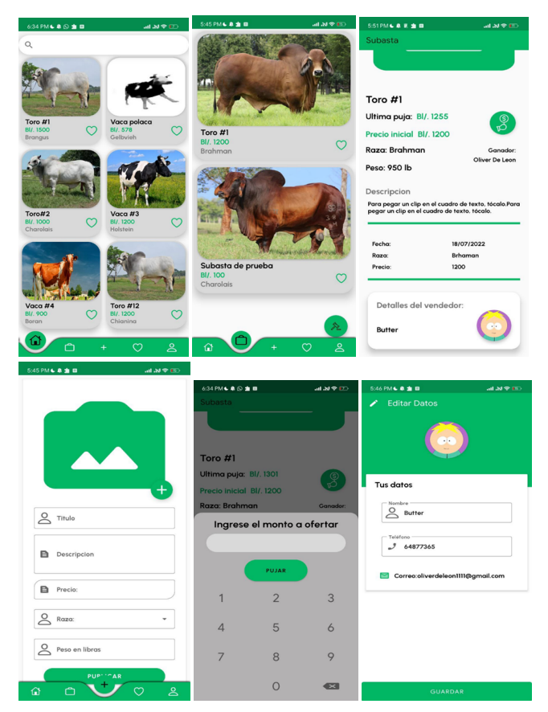

s## Ajeo - Aplicación Móvil para Compra y Venta de Ganado (Proyecto en desarrollo)

### Descripción del Proyecto
Ajeo es una aplicación móvil desarrollada en Java que permite a los usuarios comprar y vender ganado de manera eficiente. La aplicación se basa en el diseño Material Design y utiliza los servicios de Firebase de Google para proporcionar una experiencia de usuario segura y confiable.

___________________________________________
### Tecnologías utilizadas 
+ Java 
+ Firebase realtime database 
+ Firebase Authentication
+ Cloud storage de Firebase

_______________________________________

### Interfaz 

